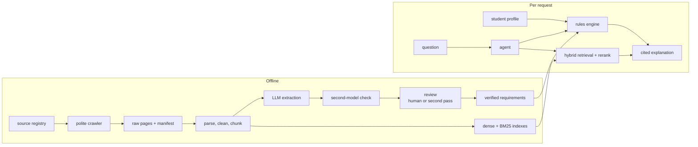

# Germany Master's Eligibility Assistant

> **Status: in development.** The data pipeline, retrieval core, requirement extraction with review, the eligibility engine and its API are built. All 13 programmes have verified requirement records: 6 verified by hand field by field, 7 by a second pass over the cited pages (see [Verification](#verification)). The engine has rule files for all 13 programmes, with every rule reviewed by hand and evaluated on 40 frozen cases (see [Eligibility evaluation](#eligibility-evaluation)). The agent, the UI and a public demo come next. See [the project plan](docs/project-plan.md).

Applying for a master's in Germany means checking a dozen official websites: the programme page, uni-assist, APS, the embassy, the blocked-account rules, the city's foreigners' office. Each one says something slightly different, and some of it is only in PDFs. This project reads those official pages for you and answers from them, with a citation and a crawl date on every claim.

A student enters their profile and gets, for each programme:

- **which published requirements they meet, miss, or haven't provided yet**, with margins ("IELTS 6.5 vs 7.0 required, short by 0.5");
- **what to fix**;
- **the visa, financial-proof and arrival rules that apply**, plus matching scholarships.

When the sources don't cover a question, it says so instead of guessing.

**What it is not:** an admission predictor. There is no public data on who gets admitted, so any "72% chance" would be invented. It is also not official advice: always confirm with the university or embassy.

## Coverage

- **Country-wide rules** (APS, uni-assist, national visa, blocked account, health insurance, residence permit, job-seeker permit): answered for any German university, from DAAD, uni-assist, APS India, the Federal Foreign Office, BAMF and city service pages.
- **Full eligibility reports** for English-taught MSc programmes in CS, Data Science and AI. 8 universities and 13 programmes: TUM, RWTH Aachen, TU Berlin, Saarland University and TU Dresden (pilot), plus KIT, TU Darmstadt and the University of Stuttgart. More universities are added after launch; that is data work, not code.
- **Anything else** (another university, another country) gets an honest "not covered yet", the general rules, and a link to the official source. Requirements are never invented.

Germany only, on purpose: one country done properly beats three done badly. Every programme record is checked against its official pages before it is used: 6 programmes by hand, field by field, and 7 by a second pass over the cited pages, through the same schema and quote check, with a completed sampled audit. See [Verification](#verification).

## How it works


```mermaid
flowchart LR
    subgraph Offline
        REG[source registry] --> CR[polite crawler]
        CR --> RAW[raw pages + manifest]
        RAW --> ING[parse, clean, chunk]
        ING --> IDX[dense + BM25 indexes]
        ING --> EXT[LLM extraction]
        EXT --> CHK[second-model check]
        CHK --> REV[review<br/>human or second pass]
        REV --> REQ[verified requirements]
    end
    subgraph Per request
        P[student profile] --> RE[rules engine]
        REQ --> RE
        Q[question] --> AG[agent]
        AG --> RET[hybrid retrieval + rerank]
        IDX --> RET
        AG --> RE
        RE --> EXP[cited explanation]
        RET --> EXP
    end
```

**The key design choice: the LLM never decides eligibility.** It extracts requirements from official pages, and every extracted record is checked against its cited official page before it is used. A deterministic rules engine compares the profile with those records. The LLM then only explains the result. So verdicts are reproducible, testable and explainable, and a prompt injection cannot change one.

### Built so far

- **Source registry**: every official URL, labelled by layer (country rules, scholarship, university), journey stage (before applying, visa document, visa and funds, arrival, after graduation), university and programme.
- **Polite crawler**:
  - respects robots.txt and refuses when it can't read it;
  - waits between requests to the same site;
  - follows and records redirects, and caps download size;
  - records a crawl date and a content hash for every page, so later re-crawls can spot changes.
  - Sites that block bots are dropped, not worked around.
- **Parsing**: HTML via BeautifulSoup, PDFs via pdfplumber, with tables kept as markdown. A structure-aware chunker splits on headings and fits the embedding model's 512-token limit. Every chunk carries its source's labels and crawl date, so retrieval can later filter by university or stage.
- **Hybrid retrieval**, all hand-written (no LangChain or LlamaIndex):
  - dense embeddings (bge-small) and BM25;
  - fused with Reciprocal Rank Fusion;
  - reranked with a cross-encoder (bge-reranker-base).
  - Every result carries its full score trace.
- **Grounded answers with a refusal gate**: if the best reranked evidence scores below a threshold, the system declines. Answers cite `[n]` markers mapped back to the source URL. Citation markers that point at no source are stripped.
- **Requirement extraction with review** (`make extract`, `make review`):
  - an LLM reads each programme's official pages and fills a typed `ProgramRequirements` record: degree, credits, grade minimums, English and entrance tests (with the countries they apply to or exempt), German level, APS, deadlines, fees, documents;
  - every field is either "not published" or carries a verbatim quote and the page it came from, and a field whose quote is not in that page is dropped;
  - a second model from a different family cross-checks every field and may suggest a fix, which must pass the same quote check;
  - a local review screen shows each field next to its quote, the full page, automatic warnings and the cross-check verdict. Every field is confirmed against its quote and page before the record is saved as verified: six programmes by hand in this screen, the other seven by a second pass over the cited pages that saves through the same quote check. Verified records are both the product data and the evaluation gold set.
- **Eligibility engine and API** (`make eligibility`, `POST /eligibility/check`): a deterministic engine checks a confirmed profile against cited rule files for all 13 programmes. Each rule returns meets, does not meet, unknown or not published, with a margin and citations, and admission, readiness and finance get separate summaries. A rule still pending review cannot produce a positive headline. `POST /profile/parse` and `make parse-profile` turn pasted text into an unconfirmed draft, keeping only fields backed by a literal span of the text.
- **Evaluation harness**: a 4-way benchmark (vector, BM25, hybrid, hybrid+rerank) on Recall@k, MRR, nDCG and p50/p95 latency, and extraction accuracy (LLM draft vs verified record). The gold question set has 122 items (requirement 45, country rules 24, confusable programmes 11, multi-hop 28, refusal 9, coverage 5), model-drafted from the verified pages; 104 are accepted by the maintainer (assisted review, not blinded) and the 18 multi-hop items added on 2026-11-12 await that review. `scripts/validate_gold.py` checks every label before `make eval` runs.
- **Observability**: request ids, structured JSON logs and per-stage latency.

### Coming next

Finish the eligibility engine (other programmes' deadlines, review of the pending rules, independent evaluation) → retrieval upgrades kept only if the numbers improve → small tool-using agent → streaming, guardrails and rate limits → UI → free public deployment → MCP server → UI polish. Details and the "done when" check for each phase are in [docs/project-plan.md](docs/project-plan.md).

The [eligibility engine spec](docs/eligibility-engine-spec.md) defines its rules, interfaces and evaluation.

## Verification

Requirement records are the product data, so how each one was verified is recorded in the record itself (`tier` in `data/verified/<slug>.json`):

- **`human` (6 programmes):** every field ticked by hand in the review screen (`make review`), next to its quote, the full page, automatic warnings and the cross-check verdict.
- **`second_pass` (7 programmes: KIT CDS, Saarland CS, TU Darmstadt AIML, TU Dresden CS, TUM DEA, TUM Informatics, Stuttgart CS):** every field re-read against its cited pages in a second pass and saved through the same Save path, which re-runs the schema and quote-in-page check. Not hand-ticked.

Every record went through the same automatic gates first: a field survives only if its verbatim quote is found in the page it cites, and a second model from a different family cross-checks every field (the second-model cross-check). Re-saving a record keeps its tier; promoting `second_pass` to `human` is a deliberate hand edit.

**Sampled audit of the second-pass tier.** The completed audit covers 35 of the original 69 stated fields (seed 4). Strict passes: 29/35 (82.86%; Wilson 95% interval 0.673–0.919); snapshot passes: 32/35 (91.43%; interval 0.776–0.970). Six confirmed findings (rows 12, 16, 20, 22, 28, 32) were corrected through the review Save path; tiers remain unchanged. These are historical pre-correction scores, not a new accuracy estimate. The original values, completed report, provenance and correction evidence are recorded in `data/audit/second_pass_audit.json`. The remaining 34 stated fields and missed fields are unscored.

**Extraction accuracy** (`evaluation/extraction_eval.py`):

| records | programmes | fields | draft unchanged | edited | dropped | added | checker precision | checker recall |
|---|---|---|---|---|---|---|---|---|
| human tier (headline) | 6 | 102 | 0.794 | 18 | 0 | 3 | 0.947 | 0.857 |
| all (second_pass not independent) | 13 | 221 | 0.814 | 35 | 3 | 3 | 0.867 | 0.634 |

How to read it: a field counts as "draft unchanged" only if its status, value, primary citation and any supporting citations are identical after normalizing absent optional defaults between the LLM draft and the verified record, so a corrected citation counts as a correction. On the 6 hand-verified programmes, 79.4% of 102 fields survived verification unchanged. Checker precision is the share of fields the cross-check flagged (wrong, partial or missed) that really changed; checker recall is the share of changed fields it flagged. The headline row uses the human tier only. Caveat: the review screen shows the cross-check verdict, so the checker numbers mean "predicts what a person who could see its verdict changed", and second-pass records were verified with the cross-check's help, so the "all" row is not independent.

## Benchmark

<!-- BENCHMARK:START -->
| config | queries | Recall@5 | Recall@10 | MRR | nDCG@5 | nDCG@10 | p50 ms | p95 ms |
|---|---|---|---|---|---|---|---|---|
| vector | 108 | 0.762 [0.693, 0.829] | 0.864 [0.812, 0.917] | 0.656 [0.586, 0.727] | 0.400 | 0.382 | 18 | 25 |
| bm25 | 108 | 0.721 [0.645, 0.795] | 0.815 [0.750, 0.875] | 0.639 [0.565, 0.714] | 0.372 | 0.347 | 2 | 3 |
| hybrid | 108 | 0.753 [0.682, 0.824] | 0.863 [0.807, 0.914] | 0.722 [0.654, 0.795] | 0.439 | 0.401 | 21 | 28 |
| hybrid_rerank | 108 | 0.829 [0.773, 0.884] | 0.863 [0.807, 0.914] | 0.749 [0.679, 0.814] | 0.471 | 0.409 | 2560 | 2804 |

_108 answerable questions; 122 total items; 605 chunks. Generated 2026-11-12T21:49:58+00:00._

_18 gold items are not yet human-reviewed: numbers that include them are provisional._

_Brackets: 95% percentile bootstrap interval over queries (2000 resamples, seed 0). Small kinds have wide intervals; read them before comparing configs._

**confusable**

| config | queries | Recall@5 | Recall@10 | MRR | nDCG@5 | nDCG@10 | p50 ms | p95 ms |
|---|---|---|---|---|---|---|---|---|
| vector | 11 | 0.818 [0.545, 1.000] | 0.909 [0.727, 1.000] | 0.594 [0.367, 0.809] | 0.317 | 0.354 | 18 | 23 |
| bm25 | 11 | 0.818 [0.545, 1.000] | 0.909 [0.727, 1.000] | 0.710 [0.463, 0.939] | 0.407 | 0.391 | 1 | 2 |
| hybrid | 11 | 0.909 [0.727, 1.000] | 1.000 [1.000, 1.000] | 0.735 [0.523, 0.939] | 0.415 | 0.405 | 21 | 29 |
| hybrid_rerank | 11 | 1.000 [1.000, 1.000] | 1.000 [1.000, 1.000] | 0.780 [0.598, 0.955] | 0.521 | 0.420 | 2575 | 2774 |

**country_rules**

| config | queries | Recall@5 | Recall@10 | MRR | nDCG@5 | nDCG@10 | p50 ms | p95 ms |
|---|---|---|---|---|---|---|---|---|
| vector | 24 | 1.000 [1.000, 1.000] | 1.000 [1.000, 1.000] | 0.762 [0.633, 0.882] | 0.548 | 0.535 | 16 | 21 |
| bm25 | 24 | 0.875 [0.708, 1.000] | 0.958 [0.875, 1.000] | 0.708 [0.562, 0.849] | 0.462 | 0.460 | 2 | 2 |
| hybrid | 24 | 1.000 [1.000, 1.000] | 1.000 [1.000, 1.000] | 0.887 [0.774, 0.972] | 0.602 | 0.563 | 20 | 23 |
| hybrid_rerank | 24 | 1.000 [1.000, 1.000] | 1.000 [1.000, 1.000] | 0.948 [0.865, 1.000] | 0.602 | 0.580 | 2487 | 2612 |

**multi_hop**

| config | queries | Recall@5 | Recall@10 | MRR | nDCG@5 | nDCG@10 | p50 ms | p95 ms |
|---|---|---|---|---|---|---|---|---|
| vector | 28 | 0.512 [0.393, 0.625] | 0.655 [0.554, 0.750] | 0.677 [0.532, 0.812] | 0.395 | 0.338 | 17 | 20 |
| bm25 | 28 | 0.548 [0.429, 0.655] | 0.679 [0.571, 0.786] | 0.657 [0.511, 0.794] | 0.357 | 0.305 | 2 | 4 |
| hybrid | 28 | 0.512 [0.399, 0.619] | 0.685 [0.583, 0.786] | 0.698 [0.548, 0.835] | 0.396 | 0.349 | 23 | 26 |
| hybrid_rerank | 28 | 0.571 [0.482, 0.661] | 0.685 [0.583, 0.786] | 0.668 [0.535, 0.794] | 0.401 | 0.339 | 2546 | 2725 |

**requirement**

| config | queries | Recall@5 | Recall@10 | MRR | nDCG@5 | nDCG@10 | p50 ms | p95 ms |
|---|---|---|---|---|---|---|---|---|
| vector | 45 | 0.778 [0.644, 0.889] | 0.911 [0.822, 0.978] | 0.601 [0.492, 0.708] | 0.344 | 0.334 | 20 | 26 |
| bm25 | 45 | 0.722 [0.589, 0.844] | 0.800 [0.667, 0.911] | 0.574 [0.449, 0.692] | 0.325 | 0.303 | 1 | 2 |
| hybrid | 45 | 0.733 [0.600, 0.867] | 0.867 [0.756, 0.956] | 0.646 [0.519, 0.765] | 0.385 | 0.345 | 20 | 36 |
| hybrid_rerank | 45 | 0.856 [0.744, 0.944] | 0.867 [0.756, 0.956] | 0.686 [0.572, 0.796] | 0.432 | 0.359 | 2599 | 2944 |

| extraction records | programmes | fields | draft unchanged | checker precision | checker recall |
|---|---|---|---|---|---|
| human tier (headline) | 6 | 102 | 0.794 | 0.947 | 0.857 |
| all (second_pass not independent) | 13 | 221 | 0.805 | 0.867 | 0.605 |

_Historical audit: 29/35 strict passes; 32/35 snapshot passes from 69 stated fields (seed 4). These are pre-correction results._

_Refusal calibration: threshold 0.201490405; 5/14 probes refused; 5/108 answerable questions falsely refused. Status: calibrated. Calibration-set results, not held-out evaluation._

| probe kind | probes | refused | missed |
|---|---|---|---|
| refusal | 9 | 4 | 5 |
| coverage | 5 | 1 | 4 |

_Answer quality (hybrid+rerank, extractive): groundedness 1.000, unsupported-claim rate 0.000, refusal rate 0.082 — token-overlap heuristic (not an LLM judge)._
<!-- BENCHMARK:END -->

`make eval` validates the gold set, uses the extractive answer path regardless of API keys, calibrates the score gate, and refreshes these results. Models are warmed before timing; the score sweep reuses retrieval results. The detailed artifact is [refusal_calibration.json](evaluation/results/refusal_calibration.json).

The selected score threshold is `0.20149040532450285`. It refuses 5/14 refusal/coverage probes while falsely refusing 5/108 answerable questions. The constraint is at most 5% false refusals; ties prefer fewer false refusals, then a lower threshold. These are calibration-set results, not held-out estimates. Actual answer refusals are reported separately in the calibration artifact.

## Run it locally

Needs [uv](https://docs.astral.sh/uv/) and Python 3.12. `crawl` fills the git-ignored `data/raw/`; `ingest`, `index`, `review` and `eval` need it, while `test`, `eligibility` and `--validate` work on a fresh clone. The first run downloads two models from Hugging Face (bge-small ~130MB, bge-reranker-base ~1.1GB). After that, everything except `make crawl` runs offline.

```bash
make install    # creates .venv and installs the pinned versions from requirements.lock
make crawl      # fetch every registry source into data/raw/ (the only network step; cached pages are skipped)
make ingest     # parse, clean and chunk -> data/processed/chunks.jsonl
make index      # dense (NumPy) + BM25 indexes
make extract    # LLM requirement drafts -> data/extracted/ (needs GEMINI_API_KEY)
make review     # review screen on http://127.0.0.1:8001 -> data/verified/
make test       # pytest (offline, uses its own fixture corpus)
make eval       # validate, benchmark, calibrate, and persist the selected threshold
make run        # API on :8000
make eligibility ARGS="--profile data/eligibility/examples/synthetic_kit_cs.json --programme kit-m-sc-computer-science --as-of 2027-05-01 --intake winter --starting-year 2027"
                # eligibility report for one profile and intake: admission, readiness and finance summaries, one line per rule
make eligibility ARGS="--validate"                # rule files bound to their records, quotes in the record; visa funds quotes against the cached page
make eligibility ARGS="--validate --check-cache"  # also requires the cached page for quotes the record lacks (needs data/raw)
make parse-profile ARGS="--input draft.txt"  # pasted text -> unconfirmed draft profile (needs GEMINI_API_KEY; synthetic text only)
make eval-eligibility  # validate evaluation/datasets/eligibility_cases.jsonl, run it, write evaluation/results/eligibility_baseline.json
                       # (exits 1 until the labelled cases are frozen and committed)
```

Frontend (Node 18+):

```bash
cd frontend
npm install
npm run dev     # :5173, talks to the API on :8000
```

No API key is needed, except for `POST /profile/parse` and `make parse-profile`. Without one, answers come from an extractive fallback, which stitches together quoted sentences from the cited evidence. For the LLM path (Gemini, free tier) and `make extract`, copy `.env.example` to `.env` and set `GEMINI_API_KEY`. The free tier allows about 20 requests a day per model; `make extract` skips finished programmes, so re-running it the next day fills the gaps. All tunables live in `config/settings.yaml`.

`requirements.lock` pins every package for Linux with CPU-only torch, the same setup CI and Docker use. On another platform, or without Make: `uv venv --python 3.12`, then `uv pip install -e '.[dev]'`.

`docker-compose.yml` (Qdrant + API + frontend) is a starting point for a containerised setup; hosting is not verified yet.

## Eligibility evaluation

`make eval-eligibility` runs the rules engine on 40 profiles whose expected verdicts were written from the cited official pages before any engine run (5 by the maintainer, 35 assisted; 17 are independent observations, the rest are variants). Result in [eligibility_baseline.json](evaluation/results/eligibility_baseline.json): 40/40 headline verdicts and 213/213 per-criterion verdicts agree, with 0 false-positive "meets" headlines. The engine decided 211 of 334 applicable criteria (63%); the rest are `unknown` because they need a university assessment (74), a fact the profile did not give (48) or a funds route with no published comparison (1), by design. Application deadlines are encoded for 12 of 13 programmes (TU Berlin publishes none on its registry pages); those added on 2026-11-12 are awaiting human review and cannot yet mark readiness as complete.

This measures agreement with the sources as read by the maintainer, not an independent audit, and it is not an admission probability.

## Honest limitations (current)

- **Free-tier LLM quota.** About 20 requests a day per model, so extraction of many programmes takes more than one day and the hosted chat will need caching.
- **Small corpus, single node.** In-memory BM25 and brute-force cosine search. Fine for thousands of chunks, not millions.
- **Small, assisted gold set.** 104 of the 122 model-authored items were accepted by the maintainer; the other 18 (multi-hop) are not yet human-reviewed, so numbers that include them are provisional. Labels still have known source overlap; this is not an independent human-written evaluation. Refusal results use the calibration set itself.
- **Score-only refusal remains weak.** The selected threshold misses 9 of 14 refusal/coverage probes while falsely refusing 5 of 108 answerable questions. Coverage checks need more than a relevance score; calibration is a measured baseline, not a solved coverage policy.
- **Seven of 13 programme records are not hand-verified.** They were verified by a second pass over the cited pages and are labelled `second_pass`; a completed 35-field sample found six strict failures, now corrected; unsampled fields remain unscored.
- **Official pages change.** Every answer shows its crawl date. A weekly re-crawl with human review of changed pages comes with deployment.
- **The extractive fallback is quotes, not prose.** It is grounded by construction but not fluent.
- **Answer groundedness is a token-overlap heuristic**, labelled as such. It is not an LLM judge.

## Privacy

Profiles will stay in the browser. The server is stateless and keeps no accounts and no personal data. Answers cite public official pages only. `POST /profile/parse` sends the pasted text to the configured LLM provider and never logs or stores it. The Gemini free tier may use prompts to improve its products, so use synthetic text there until a hosted privacy notice and a suitable provider are in place.
